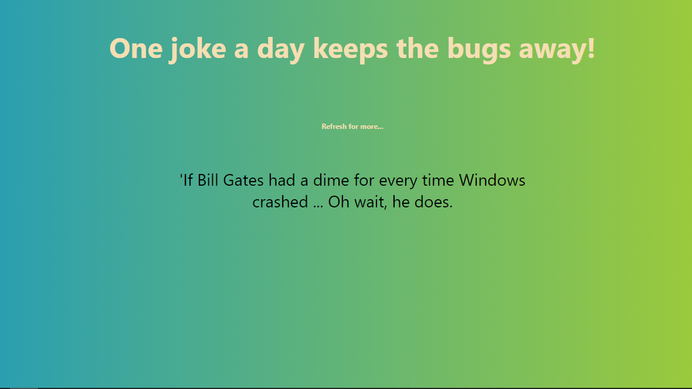

## Random Joke Generator

The project generates random programming jokes. Refresh to read different jokes. the jokes are generated with the help of API call.

### Available Scripts

npm install
npm start
